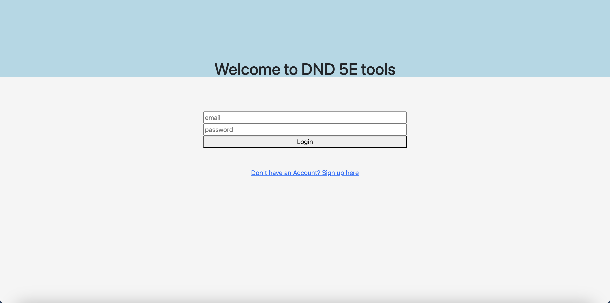
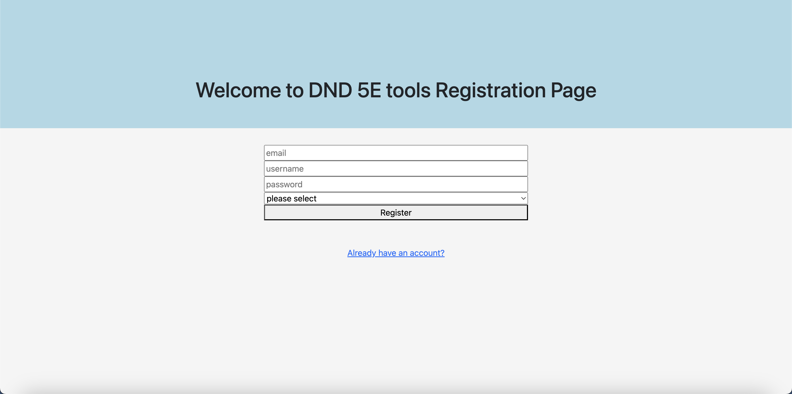
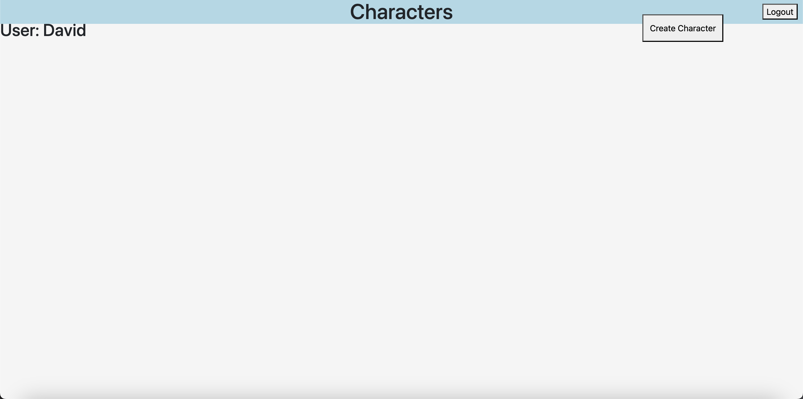
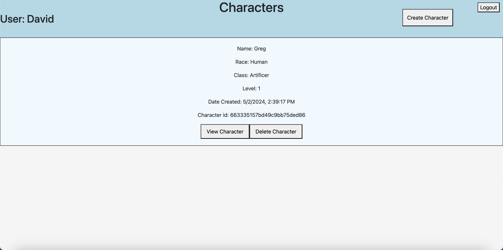

# GA-Project4

This app is a game called Dungeons and Dragons 5th Edition, or otherwise called D&D 5E. This app allows you to create your own characters using the basic rules of the game.

## Features

- Login & Registration
- Lovely cute pet dogs to adopt
- Feed, Train & Play with your furry companion!
- Daily tasks to accomplish with your wonderful furriend based on your goals for this app!
- Adopt more dogs as you increase your closeness and relationship with your furkids!

## Screenshots

This image is the login with a registration link that will bring you to the register page.

This image is the registration page when you clicked on the registrations link. Here you can register by inputing your email, username, password and what role you want to take.

This image is the main page of the player before adding any characters when you logged in. Your name will be shown on the top left of the page and you can create a character when you click on the create character button on the top right. You can also logout from your account when you click on the top right of the page.

This image is the main page of the player if you have any character when you logged in. Your name will be shown on the top left of the page and you can create a character when you click on the create character button on the top right. You can also logout from your account when you click on the top right of the page.

This image is after clicking on the adding character button. Here you will create your own character that you envision.

This image is after adding the character that you made.

## Technologies Used

- HTML
- CSS
- Javascript
- React
- MongoDB
- Express

## Environment Variables

To run this project, you will need to add the following environment variables to your .env file

[Frontend]

`VITE_SERVER`
`ACCESS_SECRET`
`REFRESH_SECRET`

[Backend]

`PORT`
`DATABASE`
`ACCESS_SECRET`
`REFRESH_SECRET`

## Learning Points

[Frontend]

- Fetch, useEffect, useState
- Component reuse
- API usage
- React

[Backend]

- Mongoose Schemas
- Routers
- Controllers
- Models
- Authentication

## Ice Box

- Images - Add character image. Currently, there are no image to show the user what that character looks like when you play as them.

- Details - Add details when you click on the abilities, classes, races, etc. There are no displayed informations for many abilities, classes, etc when you want to see which of your abilities do what.

- Spells - Add spells to spellcaster. There is no spells in the database and is important to all spellcasters. It will be added during the next update.

- Feats - Add feats to character. There is no feats in the database and is important to most characters. It will be added during the next update.
