# GA-Project4

This app is a game called Dungeons and Dragons 5th Edition, or otherwise called D&D 5E. This app allows you to create your own characters using the basic rules of the game.

## Features

- Login & Registration
- Logout after you are done
- Create your character as a player
- View your character as a player
- Edit your character as a player
- Delete your character as a player

- Create your character as a dungeon master
- View your character as a dungeon master
- Edit your character as a dungeon master
- Delete your character as a dungeon master
- Create your NPC as a dungeon master
- View your NPC as a dungeon master
- Edit your NPC as a dungeon master
- Delete your NPC as a dungeon master

## Screenshots

This image is the login with a registration link that will bring you to the register page.

This image is the registration page when you clicked on the registrations link. Here you can register by inputing your email, username, password and what role you want to take. Currently, there is only player

This image is the main page of the player before adding any characters when you logged in. Your name will be shown on the top left of the page and you can create a character when you click on the create character button on the top right. You can also logout from your account when you click on the top right of the page and it will bring you to the login page. You can click on the view character to go into the character view page and see what you have created. You can also delete your characters when you click on the delete character.

This image is the main page of the player if you have any character when you logged in. Your name will be shown on the top left of the page and you can create a character when you click on the create character button on the top right. You can also logout from your account when you click on the top right of the page and it will bring you to the login page.

This image is after clicking on the adding character button. Here you will create your own character that you envision.
Here you will input your name for you character. Pick one of the basic races, classes and backgrounds. Your features you have to input yourself while refering to the books. The level you should be starting at level 1 or whatever your dm(Dungeon Master) says.

Here you will select only two savingthrows that your class gives you. If you select two, the check box will be disable and not allow you to add in more.

Here you will select your character skills from your class and background. There is no limit to your selection.

Here you will input your ability score for strength, dexterity, consitution, intelligence, wisdom and charisma. You will also input your maximum hitpoints and current hitpoints, both would be the same for the purpose of character creation.

Here you will input your armor class(AC) in numbers and input your inventory. The inventory you will take from your class and backgrounds. On the bottom of the character creation, there are two buttons. Create character will take what you input and create a character for you and will bring you to the character display page in which you will see your own created character. Go back to character will erase all your inputs and brings you to the character display page .

This image is after clicking on the view character that you made. Here you can see your character details that you input in. There are two buttons you can click, go back to character list will bring you to the character display page. The edit button will bring you to the edit character page.
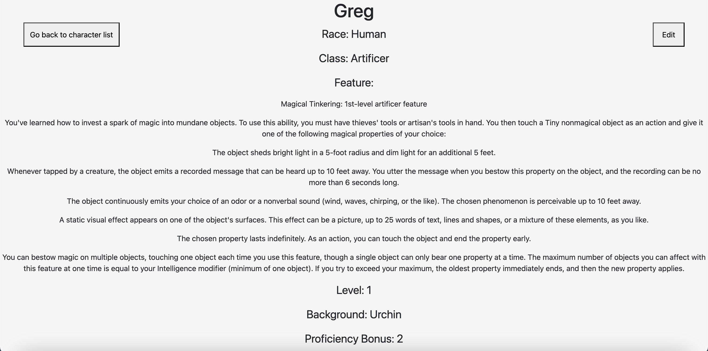

Here you can see you savingthrows, skills and your ability scores. You can also edit your maximum hit point, your current hit points and your temporary hit points and armor class that you can change on the fly.
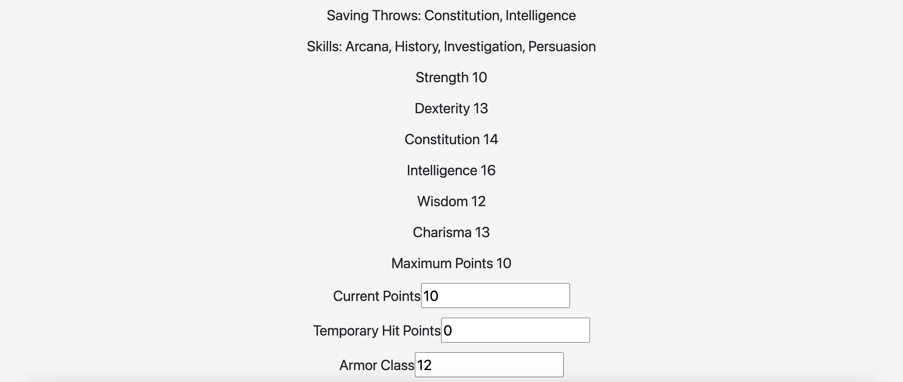

Here you can see your inventory and edit it whenever.
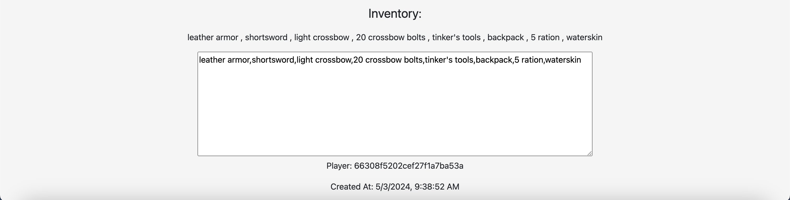

This image is after clicking on the edit button. Here you can update your inputs to your characters. It is mostly the same as character creation but with the newly added proficiency bonus. There are two buttons, the cancel button will bring you back to the character view without any chanags to your character, while the save will save your changes and display your input in your character.
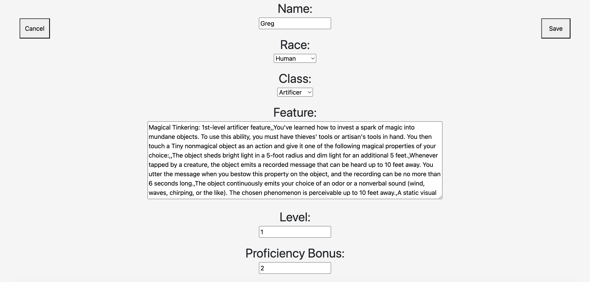

Here you can change your backgrounds and selecting more or less savingthrows.

Here you can select more or less for your skills.

Here you can change your input for your ability scores and hitpoints.
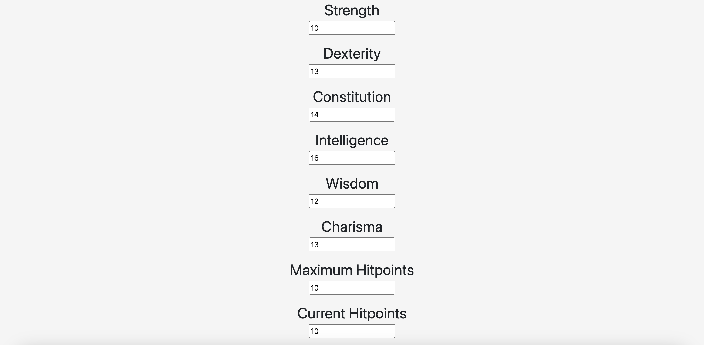

Here you can change your input for your temporary hit points and armor class. You can add more or erase your inventory.
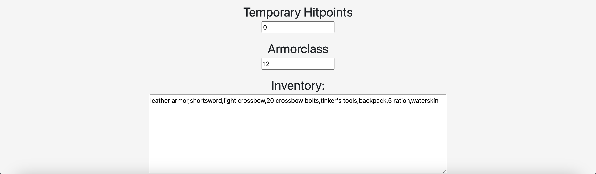

This image is after logging in as a Dungeon Master (DM). Here you can see that the DM has access to all the players characters. You can view character, delete character, create character. There is a navbar on top of the page and you can navigate between Player and NPCs.
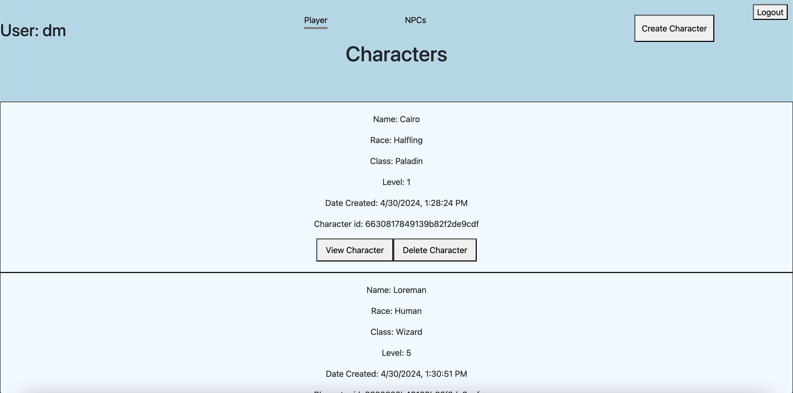
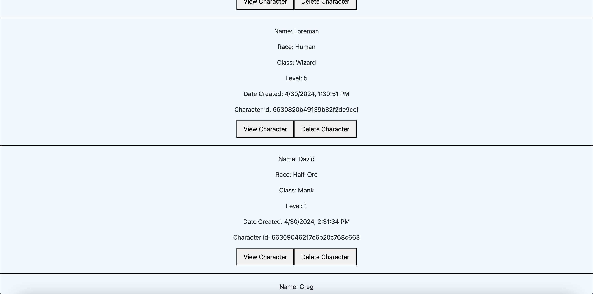

Here you can view and edit the player's character.
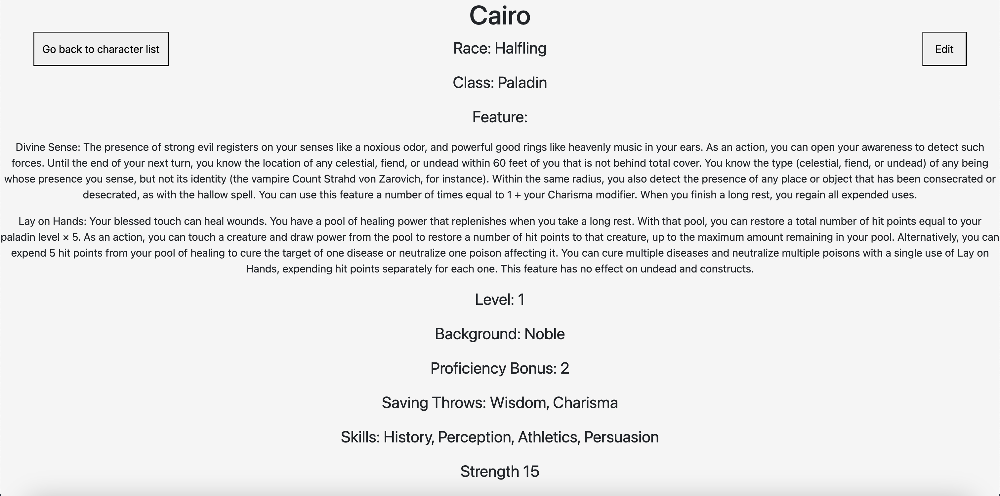
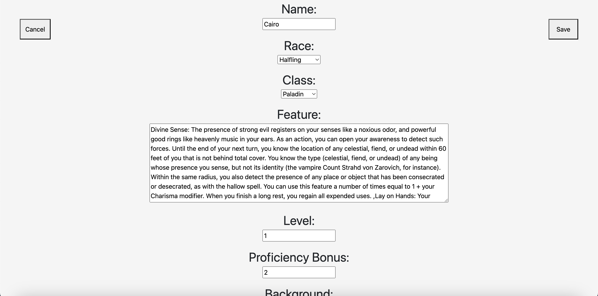

This image is when you click on top of the page there is a navbar for NPCs. Here you can click on view NPC button to view the NPC details or delete NPC button to delete it. You can see your username on the top left and logout on the logout button on the top right. You can also click on the create NPC button that will bring you to the create NPC page.
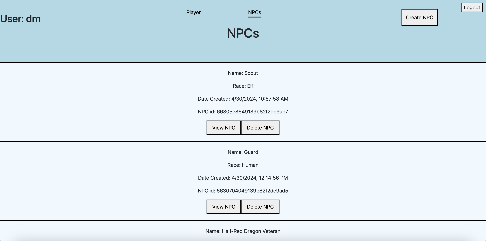

This image is when you click on the create NPC button. Here you can input your NPC's name and features. You can choose the race of the NPC as well as savingthrows.
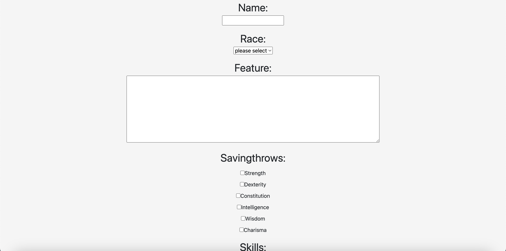

Here you can select skills for your NPC.
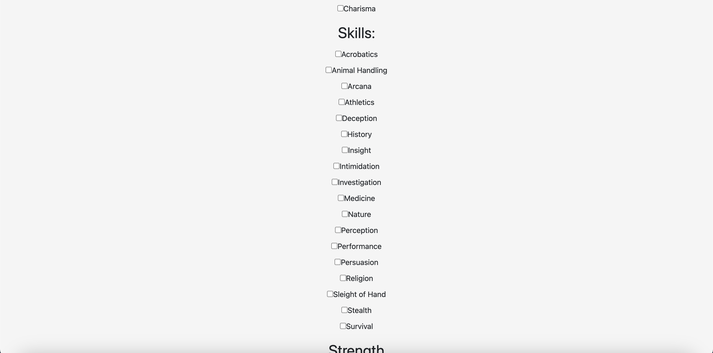

Here you can input your ability scores, maximum and current hit points for you NPC.
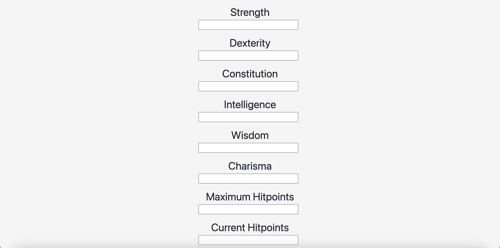

Here you can input your armor class (AC) for your NPC. The create NPC will take your input for your NPC and create it, and brings you to the NPC view page. Go back to NPC list will not save your NPC and go back to the NPC view page.
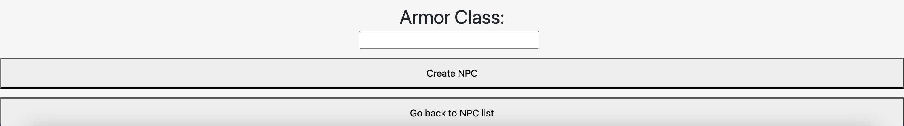

This image is when you click on view NPC button. Here you can view your NPC's details.
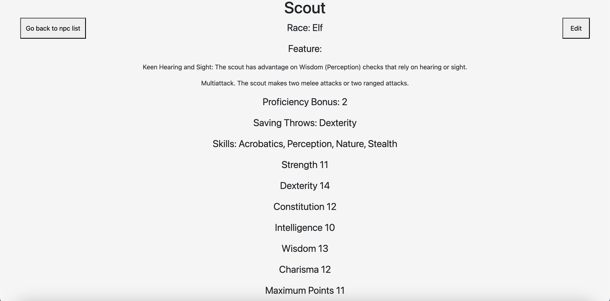

Here you can edit your NPC's hitpoints and armor class (AC) on the fly.

This image is when you click on the edit button. Here you can edit your NPC's name, features and proficiency bonus. You can add or remove savingthrows. There are two buttons, the cancel button will bring you back to the NPC view without any chanags to your character, while the save will save your changes and display your input in your NPC.
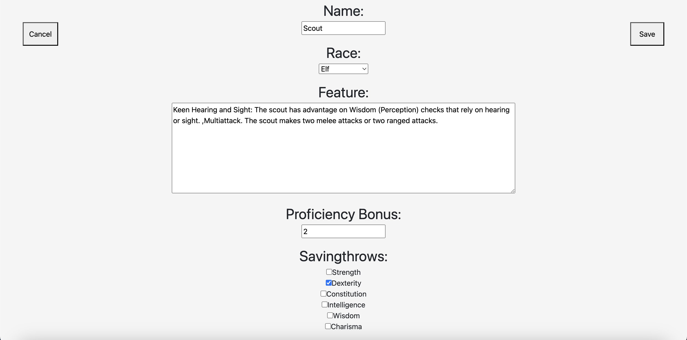

Here you can add more or remove skills.

Here you can change your input on your ability scores(AS), your maximum and current hit points.
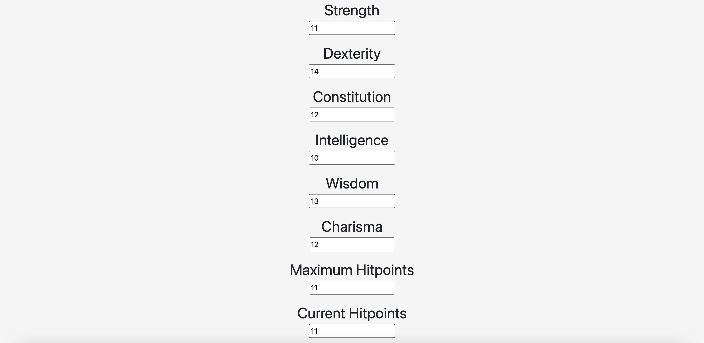

Here you can change your armor class (AC)

## Technologies Used

- HTML
- CSS
- Javascript
- React
- MongoDB
- Express

## Environment Variables

To run this project, you will need to add the following environment variables to your .env file

[Frontend]

`VITE_SERVER`
`ACCESS_SECRET`
`REFRESH_SECRET`

[Backend]

`PORT`
`DATABASE`
`ACCESS_SECRET`
`REFRESH_SECRET`

## Learning Points

[Frontend]

- Fetch, useEffect, useState
- Component reuse
- API usage
- React

[Backend]

- Mongoose Schemas
- Routers
- Controllers
- Models
- Authentication

## Ice Box

- Images - Add character image. Currently, there are no image to show the user what that character looks like when you play as them.

- Details - Add details when you click on the abilities, classes, races, etc. There are no displayed informations for many abilities, classes, etc when you want to see which of your abilities do what.

- Spells - Add spells to spellcaster. There is no spells in the database and is important to all spellcasters. It will be added during the next update.

- Feats - Add feats to character. There is no feats in the database and is important to most characters. It will be added during the next update.

## Known Bugs

- When you input any characters in the strength, dexterity, consitution, intelligence, wisdom and charisma. The proficency bonus, maximum hitpoints, current hitpoints, temporaray hitpoints and armor class(AC).
